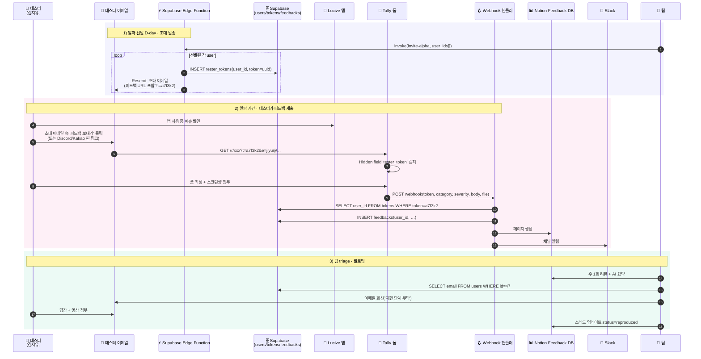

# Lucive 알파 피드백 파이프라인 — 실제 도입 플로우

> 알파 초대 → 피드백 수집 → 팔로업까지 end-to-end. 모든 단계에 실제 데이터 예시 포함.
> 전제: 인앱 UI 개발 불가 / 테스터 50–100명 / 자동 tracking 의존 금지.

---

## 0. 전체 시퀀스



---

## 1) 데이터 스키마

### `tester_tokens` — 토큰 ↔ 유저 매핑
```sql
create table tester_tokens (
  token text primary key,                -- uuid, URL에 노출
  user_id uuid not null references users(id),
  issued_at timestamptz default now(),
  expires_at timestamptz default now() + interval '90 days',
  revoked boolean default false
);
create index on tester_tokens(user_id);
```

### `feedbacks` — 수집된 피드백
```sql
create table feedbacks (
  id uuid primary key default gen_random_uuid(),
  user_id uuid references users(id),          -- 토큰으로 조인해 채움
  token text references tester_tokens(token),
  category text check (category in ('bug','improvement','idea','content','other')),
  severity text check (severity in ('critical','high','medium','low')),
  body text not null,
  reproduction_steps text,
  screenshot_url text,                         -- Tally storage URL
  app_version text,
  device text,
  status text default 'new'                    -- new | triaged | in_progress | resolved | wontfix
    check (status in ('new','triaged','in_progress','resolved','wontfix')),
  assigned_to uuid references team_members(id),
  notion_page_id text,                         -- 양방향 싱크용
  created_at timestamptz default now(),
  updated_at timestamptz default now()
);
create index on feedbacks(status);
create index on feedbacks(user_id);
```

---

## 2) [단계 1] 초대 이메일 발송 — Edge Function

```typescript
// supabase/functions/invite-alpha/index.ts
import { serve } from "https://deno.land/std/http/server.ts";
import { Resend } from "npm:resend";
import { createClient } from "npm:@supabase/supabase-js";

const resend = new Resend(Deno.env.get("RESEND_API_KEY"));
const supabase = createClient(
  Deno.env.get("SUPABASE_URL")!,
  Deno.env.get("SUPABASE_SERVICE_ROLE_KEY")!
);

serve(async (req) => {
  const { user_ids } = await req.json();

  for (const user_id of user_ids) {
    const { data: user } = await supabase
      .from("users").select("*").eq("id", user_id).single();

    // 1. 고유 토큰 발급
    const token = crypto.randomUUID().replace(/-/g, "").slice(0, 12);
    await supabase.from("tester_tokens").insert({ token, user_id });

    // 2. 피드백 URL 조립
    const feedbackUrl = `https://tally.so/r/wA8Xk2?t=${token}&e=${encodeURIComponent(user.email)}`;

    // 3. 초대 이메일 발송
    await resend.emails.send({
      from: "Lucive <alpha@lucive.app>",
      to: user.email,
      subject: "🎉 Lucive 알파 테스터로 선발되셨습니다",
      html: renderInviteTemplate({
        name: user.name,
        invite_link: `https://alpha.lucive.app/?token=${user.alpha_token}`,
        feedback_url: feedbackUrl,           // ← 이 링크가 핵심
        discord_invite: "https://discord.gg/lucive-alpha",
      }),
    });
  }
  return new Response("OK");
});
```

**초대 이메일 본문 발췌** (`feedback_url`이 본문과 푸터에 모두 들어감):
```
김지유님, Lucive 알파에 오신 것을 환영합니다.

[알파 시작하기 →] [피드백 보내기 →]

알파 기간 중 언제든 아래 링크로 피드백을 보내주세요:
https://tally.so/r/wA8Xk2?t=a7f3k2d9e1&e=jiyu%40example.com

(이 링크는 김지유님 전용입니다. 저희가 자동으로 누가 보낸 피드백인지 알 수 있어,
 추가 문의가 필요하면 이 이메일로 답장드립니다.)
```

---

## 3) [단계 2] Tally 폼 설정

### 폼 구조 (필드)
| 필드명 | 타입 | 필수 | 비고 |
|---|---|---|---|
| `tester_token` | **Hidden Field** | ✓ | URL `?t=…` 자동 캡처 |
| `email_backup` | **Hidden Field** | | URL `?e=…` 자동 캡처 (토큰 유실 대비) |
| `category` | Multiple choice | ✓ | Bug / Improvement / Idea / Content / Other |
| `severity` | Multiple choice | ✓ | Critical / High / Medium / Low |
| `body` | Long text | ✓ | "무엇을 보았고, 어떻게 되길 기대하셨나요?" |
| `steps` | Long text | | 재현 단계 (선택) |
| `screenshot` | File upload | | 최대 10MB |
| `app_version` | Short text | | placeholder: "v0.3.1" |
| `device` | Short text | | placeholder: "iPhone 15 Pro / iOS 17.4" |
| `contact_ok` | Checkbox | ✓ | "추가 문의 시 이 이메일로 연락받아도 괜찮습니다 (PIPA 동의)" |

### Hidden Field 세팅 (Tally)
`Settings → Form behavior → URL parameters` 에서:
- `t` → `tester_token`
- `e` → `email_backup`

### 다국어 폼 분기
- 한국어: `tally.so/r/wA8Xk2` (기본)
- 영어: `tally.so/r/ENxxxx` (`/feedback/en` 리다이렉트로 유도)
- 일본어: `tally.so/r/JPxxxx`

---

## 4) [단계 2-b] Webhook 핸들러

```typescript
// supabase/functions/feedback-webhook/index.ts
serve(async (req) => {
  // Tally webhook HMAC 검증
  const signature = req.headers.get("tally-signature");
  const body = await req.text();
  if (!verifyTallySignature(body, signature)) {
    return new Response("invalid signature", { status: 401 });
  }
  const payload = JSON.parse(body);

  // Tally payload 에서 필드 추출
  const fields = Object.fromEntries(
    payload.data.fields.map((f: any) => [f.label, f.value])
  );
  const token = fields.tester_token;

  // 1. 토큰 → user_id 조회
  const { data: tokenRow } = await supabase
    .from("tester_tokens")
    .select("user_id, revoked")
    .eq("token", token)
    .single();

  if (!tokenRow || tokenRow.revoked) {
    // 토큰 불일치 시 이메일 backup 으로 fallback
    const { data: u } = await supabase
      .from("users").select("id").eq("email", fields.email_backup).single();
    if (!u) return new Response("unknown tester", { status: 400 });
    tokenRow.user_id = u.id;
  }

  // 2. feedbacks INSERT
  const { data: fb } = await supabase.from("feedbacks").insert({
    user_id: tokenRow.user_id,
    token,
    category: fields.category,
    severity: fields.severity,
    body: fields.body,
    reproduction_steps: fields.steps,
    screenshot_url: fields.screenshot?.[0]?.url,
    app_version: fields.app_version,
    device: fields.device,
  }).select().single();

  // 3. Notion 페이지 생성
  const notionPage = await notion.pages.create({
    parent: { database_id: NOTION_FEEDBACK_DB },
    properties: {
      Title:     { title: [{ text: { content: fields.body.slice(0,80) }}]},
      Tester:    { rich_text: [{ text: { content: `#${tokenRow.user_id}` }}]},
      Category:  { select: { name: fields.category }},
      Severity:  { select: { name: fields.severity }},
      Status:    { select: { name: "new" }},
      CreatedAt: { date: { start: new Date().toISOString() }},
    },
    children: [
      { paragraph: { rich_text: [{ text: { content: fields.body }}]}},
      ...(fields.steps ? [{ heading_3: { rich_text:[{text:{content:"재현 단계"}}]}},
                          { paragraph:   { rich_text:[{text:{content: fields.steps}}]}}] : []),
    ],
  });

  await supabase.from("feedbacks")
    .update({ notion_page_id: notionPage.id })
    .eq("id", fb.id);

  // 4. Slack 알림
  await fetch(Deno.env.get("SLACK_WEBHOOK_URL")!, {
    method: "POST",
    body: JSON.stringify({
      text: `🆕 피드백 #${fb.id.slice(0,6)} · *${fields.severity}* · ${fields.category}`,
      blocks: [
        { type:"section", text:{ type:"mrkdwn", text:
          `*테스터*: #${tokenRow.user_id}\n*내용*: ${fields.body.slice(0,200)}`}},
        { type:"actions", elements: [
          { type:"button", text:{type:"plain_text",text:"Notion 열기"}, url: notionPage.url },
          { type:"button", text:{type:"plain_text",text:"테스터에게 이메일"},
            url: `mailto:${fields.email_backup}?subject=Re:%20${fb.id}` },
        ]},
      ],
    }),
  });

  return new Response("OK");
});
```

---

## 5) [단계 3] 팀 triage & 팔로업

### Notion Feedback DB 뷰 (3개)

1. **📥 Inbox** — `status = new`, Severity 내림차순 (critical 먼저)
2. **🔁 In Progress** — 담당자 배정됨, 주간 스탠드업 리뷰
3. **📊 Weekly Theme** — Notion AI `/ai summarize` 로 주 1회 테마 뽑아서 팀 미팅 아젠다

### 팔로업 표준 SOP

| 시점 | 누가 | 액션 |
|---|---|---|
| 제출 즉시 | 자동 | Slack 알림 + Notion 생성 |
| 영업시간 내 | 당번 PM | Notion에서 status=triaged, 담당자 배정, 필요시 Ctrl+click "테스터에게 이메일" |
| 24–48h 내 | 담당자 | Supabase에서 `users.email` 조회 → 회신 (아래 템플릿) |
| 해결 시 | 담당자 | status=resolved, 테스터에게 "반영되었습니다" 이메일 |

### 팔로업 이메일 템플릿
```
제목: Re: 피드백 #a7f3 · Lucive 팀입니다

김지유님,

보내주신 피드백("아리아가 3번째 다이브에서 캐릭터 설정이
달라졌다")을 팀에서 살펴보고 있습니다.

재현을 위해 몇 가지 확인드릴 게 있어 연락드립니다:
1. 해당 다이브에서 쓰신 모델은 무엇이었나요? (basic / pro)
2. 이전 2번의 다이브와 캐릭터를 동일하게 유지하셨나요?
3. 혹시 그 시점의 스크린샷이 추가로 있으시면 첨부 부탁드려요.

보내주신 덕분에 아리아가 더 일관된 존재가 됩니다. 감사합니다.

— Lucive 팀 드림
```

---

## 6) 실제 데이터 예시 (한 사이클)

### 6-1. 토큰 발급 직후 `tester_tokens`
```json
{
  "token": "a7f3k2d9e1c4",
  "user_id": "8c2a7f3e-2b1a-4e8d-9c3f-6d2e4a8c1b5d",
  "issued_at": "2026-05-01T09:00:00+09:00",
  "expires_at": "2026-07-30T09:00:00+09:00",
  "revoked": false
}
```

### 6-2. 김지유가 받은 Tally 폼 URL
```
https://tally.so/r/wA8Xk2?t=a7f3k2d9e1c4&e=jiyu%40example.com
```

### 6-3. Tally webhook payload (축약)
```json
{
  "eventId": "evt_9281",
  "eventType": "FORM_RESPONSE",
  "data": {
    "responseId": "resp_7FkQ3",
    "submittedAt": "2026-05-08T14:32:11+09:00",
    "fields": [
      { "label": "tester_token", "value": "a7f3k2d9e1c4" },
      { "label": "email_backup", "value": "jiyu@example.com" },
      { "label": "category", "value": "bug" },
      { "label": "severity", "value": "high" },
      { "label": "body", "value": "아리아가 3번째 다이브에서 자기 과거를 다른 내용으로 얘기했어요. 네온 7구 출신이라고 했다가 갑자기 2구 출신이라고..." },
      { "label": "steps", "value": "1) 아리아 다이브 시작\n2) '네가 자란 동네 얘기 해줘' 입력\n3) 첫/둘째 다이브: 7구 / 셋째: 2구" },
      { "label": "screenshot", "value": [{"url":"https://storage.tally.so/.../IMG_2847.png"}] },
      { "label": "app_version", "value": "v0.3.1" },
      { "label": "device", "value": "iPhone 15 Pro / iOS 17.4" },
      { "label": "contact_ok", "value": true }
    ]
  }
}
```

### 6-4. `feedbacks` INSERT 결과
```json
{
  "id": "fb_2c4a891e",
  "user_id": "8c2a7f3e-2b1a-4e8d-9c3f-6d2e4a8c1b5d",
  "token": "a7f3k2d9e1c4",
  "category": "bug",
  "severity": "high",
  "body": "아리아가 3번째 다이브에서…",
  "reproduction_steps": "1) 아리아 다이브 시작…",
  "screenshot_url": "https://storage.tally.so/.../IMG_2847.png",
  "app_version": "v0.3.1",
  "device": "iPhone 15 Pro / iOS 17.4",
  "status": "new",
  "notion_page_id": "b2f9…",
  "created_at": "2026-05-08T14:32:12+09:00"
}
```

### 6-5. Slack 메시지 프리뷰
```
🆕 피드백 #fb_2c4a · high · bug
테스터: #47 (김지유)
내용: 아리아가 3번째 다이브에서 자기 과거를 다른 내용으로 얘기했어요.
     네온 7구 출신이라고 했다가 갑자기 2구 출신이라고…

[ Notion 열기 ]  [ 테스터에게 이메일 ]
```

---

## 7) 실패 시나리오 & 복구

| 상황 | 처리 |
|---|---|
| 테스터가 URL을 복사해 친구에게 공유 → 친구가 제출 | 토큰은 1회 재사용 가능 (revoked=false이므로). 하지만 친구 이메일이 `email_backup`과 다르면 **Webhook에서 불일치 플래그** → Notion에 `⚠ token_email_mismatch` 태그 자동 부여 |
| 테스터가 `?t=…` 를 지우고 제출 | `email_backup` 로 폴백. 둘 다 없으면 "익명 제보" status 부여, 팔로업 불가 처리 |
| Tally 폼 다운 | 이메일 주소로 fallback ("직접 회신해주세요") 안내 자동 응답 |
| Notion API rate limit | 큐잉 재시도 (Supabase `pg_cron` + `notion_sync_queue` 테이블) |
| Slack webhook 실패 | Supabase logs 에만 남고 진행 — 중요도 낮음 |

---

## 8) 롤아웃 체크리스트

**T-7일**
- [ ] Supabase 마이그레이션 실행 (`tester_tokens`, `feedbacks`)
- [ ] `invite-alpha` Edge Function 배포
- [ ] `feedback-webhook` Edge Function 배포 + URL 확인
- [ ] Tally 폼 3개 제작 (KR/EN/JP) + Hidden Field 매핑 확인
- [ ] Tally webhook → Supabase Function URL 연결
- [ ] Notion Feedback DB 생성 + Integration 토큰 발급
- [ ] Slack `#alpha-feedback` 채널 + Incoming Webhook 설정

**T-3일**
- [ ] 내부 테스터 3명으로 end-to-end 리허설 (초대 → 제출 → Slack → 팔로업)
- [ ] 팀 triage SOP 문서 최종화 + 당번 로테이션 확정
- [ ] PIPA 동의문·개인정보 처리방침 페이지 업데이트

**T-0일 (알파 시작)**
- [ ] 선발자 100명 대상 `invite-alpha` 실행
- [ ] Discord/KakaoTalk 핀 메시지에 Tally 링크 추가 (토큰 없는 버전은 없음 — 유저별 이메일로만 전달)
- [ ] 첫 24시간 에러 모니터링

**W+1**
- [ ] 첫 주 피드백 20~30건 가정, Notion AI 요약 리뷰
- [ ] 팀 미팅에서 Top 5 테마 결정

---

## 9) 확장 방향 (이후)

- **베타 이후**: 인앱 UI 개발 여력 생기면 → Tally 폼을 앱 내 webview 로 embed (URL 동일, 토큰은 앱이 자동 주입)
- **AI 자동 분류**: Kraftful 또는 Viable API 를 `feedbacks.body` → `auto_tags` 컬럼에 채우는 cron job
- **유저 대시보드**: 테스터 본인이 제출한 피드백 상태를 볼 수 있는 페이지 (`/feedback/my?token=…`)
- **Netflix-스타일 해결 알림**: status → resolved 전환 시 테스터에게 자동 이메일 "올려주신 피드백이 v0.4.0에서 반영되었습니다"
